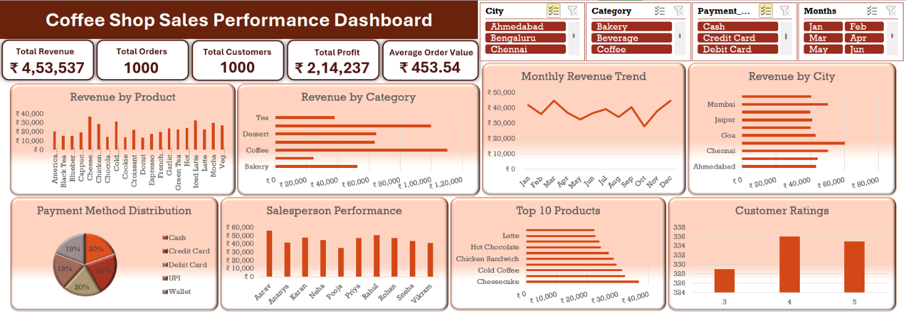

# ☕ Coffee Shop Sales Performance Dashboard (Microsoft Excel)

An interactive **Coffee Shop Sales Performance Dashboard** built using **Microsoft Excel** to analyze sales performance, product trends, customer behavior, payment methods, and business KPIs through interactive visualizations.

---

## 📸 Dashboard Preview

---

## 📌 Project Overview

This project demonstrates how Microsoft Excel can be used as a powerful Business Intelligence tool to transform raw sales data into meaningful insights.

The dashboard enables users to explore sales performance dynamically using interactive slicers and visually appealing charts.

---

## 🎯 Business Objectives

- Analyze overall sales performance.
- Track monthly revenue trends.
- Identify top-performing products.
- Compare revenue across categories and cities.
- Monitor payment method distribution.
- Evaluate salesperson performance.
- Understand customer rating patterns.

---

## 📊 Key Performance Indicators (KPIs)

- 💰 Total Revenue
- 🛒 Total Orders
- 👥 Total Customers
- 📈 Total Profit
- 💵 Average Order Value

---

## 📈 Dashboard Visualizations

- Revenue by Product
- Revenue by Category
- Monthly Revenue Trend
- Revenue by City
- Payment Method Distribution
- Salesperson Performance
- Top 10 Products
- Customer Ratings

---

## ✨ Features

- Interactive Dashboard
- Dynamic Slicers
- Pivot Tables
- Pivot Charts
- KPI Cards
- XLOOKUP
- Data Cleaning
- Business Insights
- Dynamic Filtering

---

## 🛠 Tools & Techniques Used

- Microsoft Excel
- Excel Tables
- Pivot Tables
- Pivot Charts
- XLOOKUP
- Slicers
- Conditional Formatting
- Data Validation
- Business Dashboard Design

---

## 💡 Skills Demonstrated

- Data Cleaning
- Data Analysis
- Dashboard Design
- Business Reporting
- Data Visualization
- Excel Automation
- KPI Reporting

---

## 📷 Screenshots

### Main Dashboard

(Images/Dashboard.png)

### Dashboard with Filters Applied

(Images/Filtered_Dashboard.png)

### Dashboard Insights

(Images/Data_Sheet.png)

---

## 🚀 Learning Outcomes

Through this project, I improved my skills in:

- Microsoft Excel
- Interactive Dashboard Development
- Data Visualization
- Business Analytics
- KPI Design
- Analytical Thinking

---

## 👩‍💻 Author

**Akanksha Naik**

Aspiring Data Analyst | Microsoft Excel | SQL | Power BI | Python

📌 GitHub: https://github.com/akankshanaik3

📌 LinkedIn: https://www.linkedin.com/in/akankshanaik314

---

⭐ If you found this project interesting, feel free to explore my other projects.
